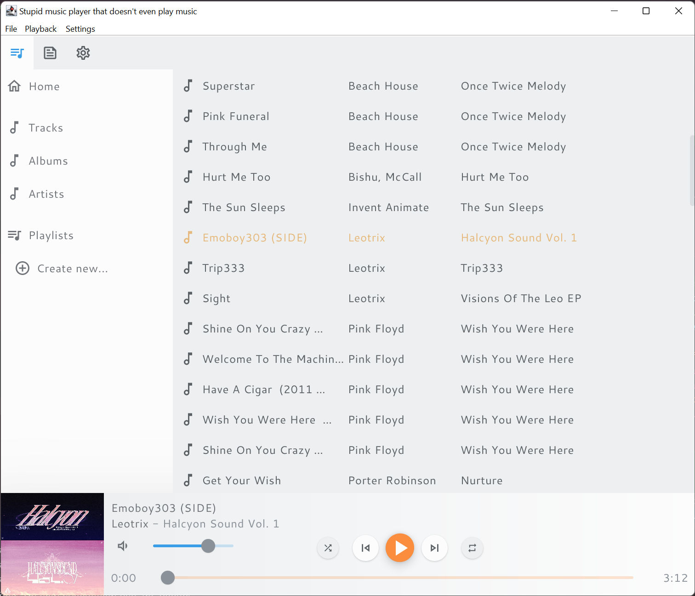

# player
A currently non-functioning, cross-platform music player with a beautiful, if impractical interface.

## Why?

Good question. The only real reason I'm making this is to keep myself busy for at least 9 months.

I don't even enjoy writing this software, it's literally just to waste time.

But it would be neat if, assuming it actually works and plays music, I could tell my imaginary friends that I'm using my own music player.

## "Goals"

- Cross-platform: Linux, Windows, macOS (done, thanks to JetBrains Compose)
- Make it look pretty (done, kinda)
- Make it play music
- Theming engine (done, albeit hard-coded)
  - Currently integrated themes: **Gruvbox** (Dark, Light) and **Ayu** (Dark, Mirage, Light)
- Last.fm integration
- Playlists
  - Will take a long time. Maybe I need to learn databases. I have been dreading this day for years.
- .csv and .m3u export

## Dev dependencies

See ``build.gradle.kts``. Executables released on GitHub come bundled with all required dependencies.

tl;dr:

- Java 11
- Kotlin 1.5.31
- JetBrains Compose 1.0.0
- JAudioTagger 3.0.1

### tw: r/badcode

Don't look too closely at this code. It's a mess. A lot of (sometimes failed) attempts at cheap and dirty solutions.